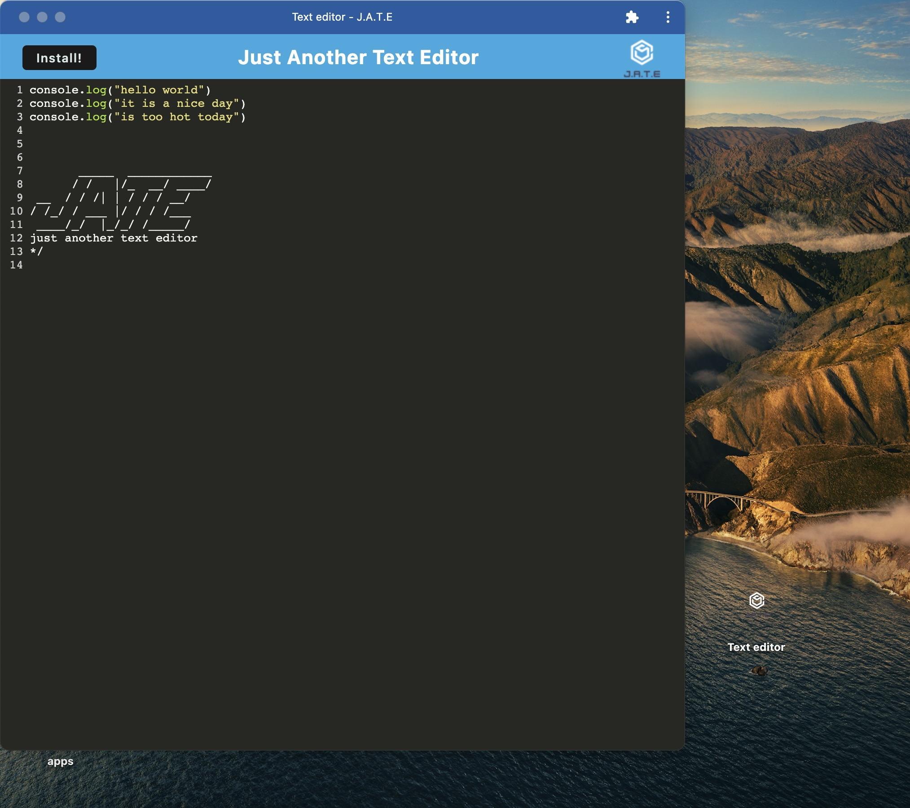
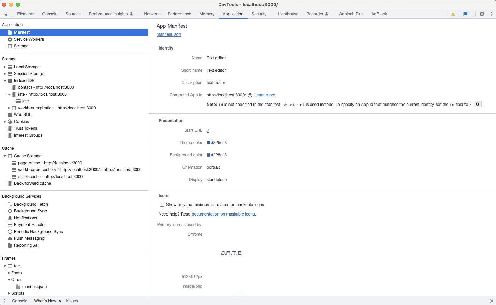
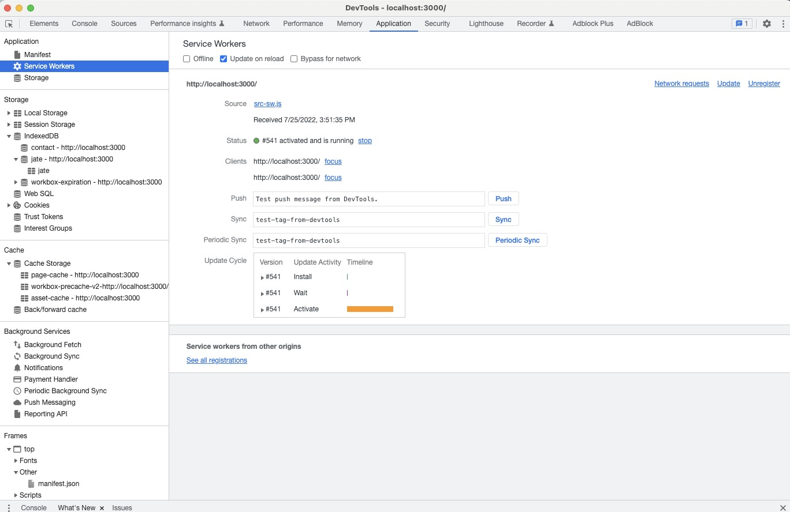
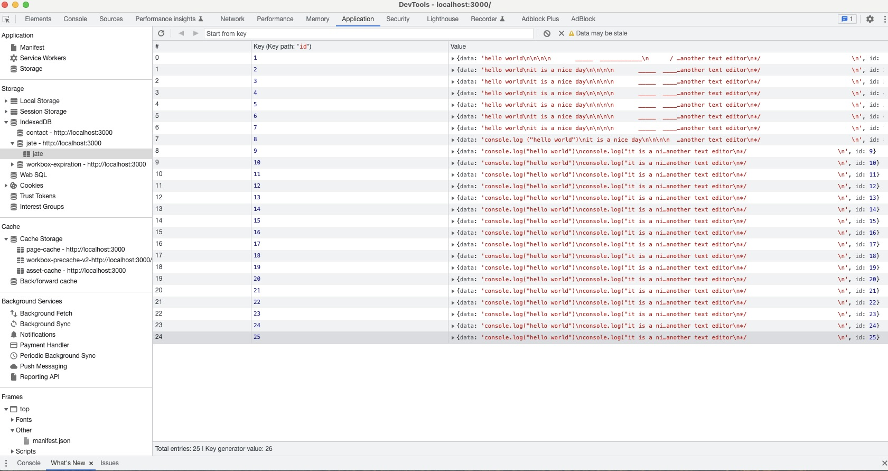

# 19 Progressive Web Applications (PWA): Text Editor

## Description

My task was to build a text editor that runs in the browser. The app is a single-page application that meets the PWA criteria. The application will also function offline.

## Installation

Clone the repo from GitHub, in the command line run npm install and npm start.

## Usage

The site is live at [this link](https://)

## Mock-Up

The following animation demonstrates the application functionality:

The following image shows the application's `manifest.json` file:

The following image shows the application's registered service worker:

The following image shows the application's IndexedDB storage:

